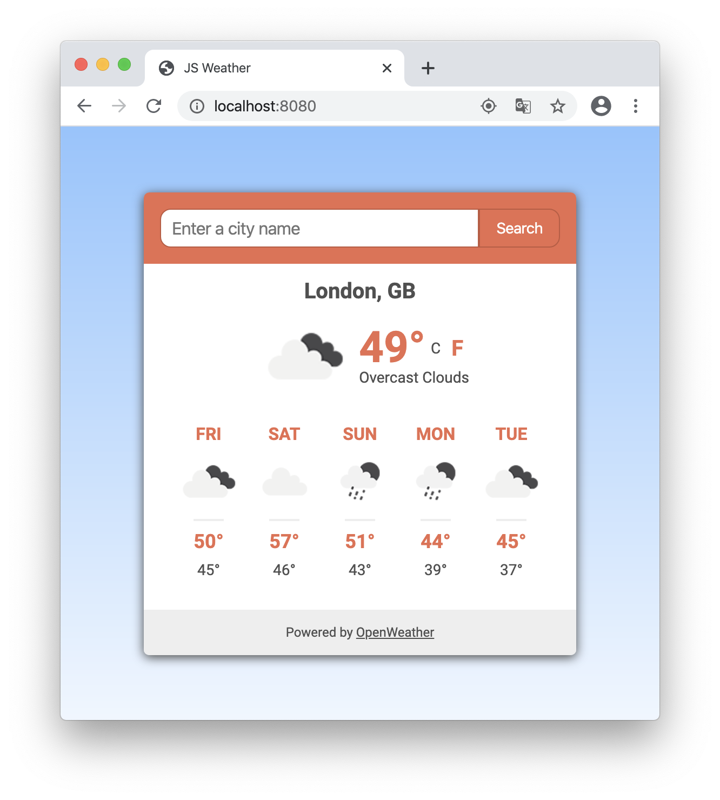

# js-weather
A simple weather app built to get familiar with asynchronous JavaScript (and now React!).



## Live version

A live version is available [here](https://raw.githack.com/elshaka/js-weather/development/dist/index.html)

## Built with

- ES6
- React
- SASS
- npm
- webpack
- [OpenWeather's API](https://openweathermap.org/api)
- [date-fns](https://date-fns.org)

## Features

- Location search (with support for the [geolocation API](https://developer.mozilla.org/en-US/docs/Web/API/Geolocation#Browser_compatibility)).
- 5 day forecast with maximum and minimum temperatures.
- Weather data caching using localStorage to reduce API hits.

## Installation

```
npm install
npm run build
```

## Start the server

```
npm start
```

## Author

👤 **Eleazar Meza**

- Github: [@elshaka](https://github.com/elshaka)
- Twitter: [@elshaka](https://twitter.com/elshaka)
- Linkedin: [Eleazar Meza](https://www.linkedin.com/in/elshaka/)
